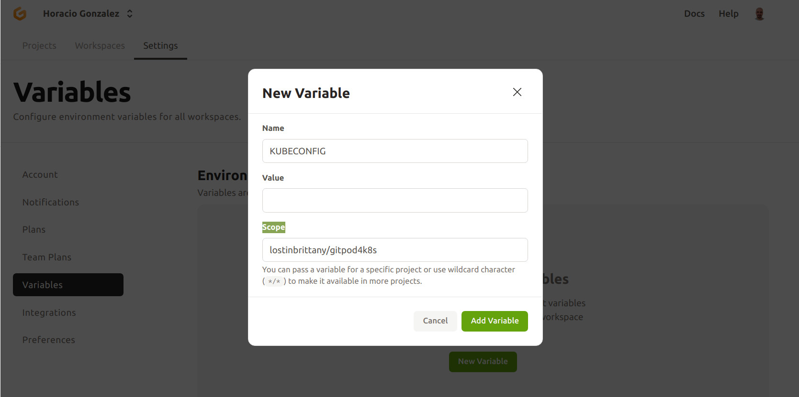

# Gitpod for K8s

A working Gitpod setup for managing Kubernetes clusters. The workspace includes Kubectl, Helm & Kustomize.

To open the workspace, simply click on the *Open in Gitpod* button, or use [this link](https://gitpod.io/#https://github.com/LostInBrittany/k8s-gitpod.git).

[](https://gitpod.io/#https://github.com/LostInBrittany/k8s-gitpod.git)

## Configuring Kubeconfig

To administrate your Kubernetes cluster from Gitpod, you need to add your Kubeconfig to your Gitpod workspace. There are two ways to do it:

### 1- Copying the into your workspace

Copy your kubeconfig into a `~/.kube/config` file in your Gitpod workspace.

```bash
nano ~/.kube/config
```

### 2- Adding your kubeconfig as a Gitpod secret

Gitpod supports encrypted, user-specific environment variables. They are stored as part of your user settings and can be used to set access tokens, or pass any other kind of user-specific information to your workspaces.

To do it you need to follow this steps:

1. Convert Kubeconfig to base64

    ```bash
    cat kubeconfig | base64 -w 0
    ```

1. Copy Kubeconfig (base64 format) to Gitpod 

    

1. Configure the project to extract kubeconfig, by editing your `.gitpod.yml` file and add this following content:

    ```yaml
    tasks:
      - name: Set K8s context
        command: echo $KUBECONFIG | base64 -d > ~/.kube/config    
    ```


